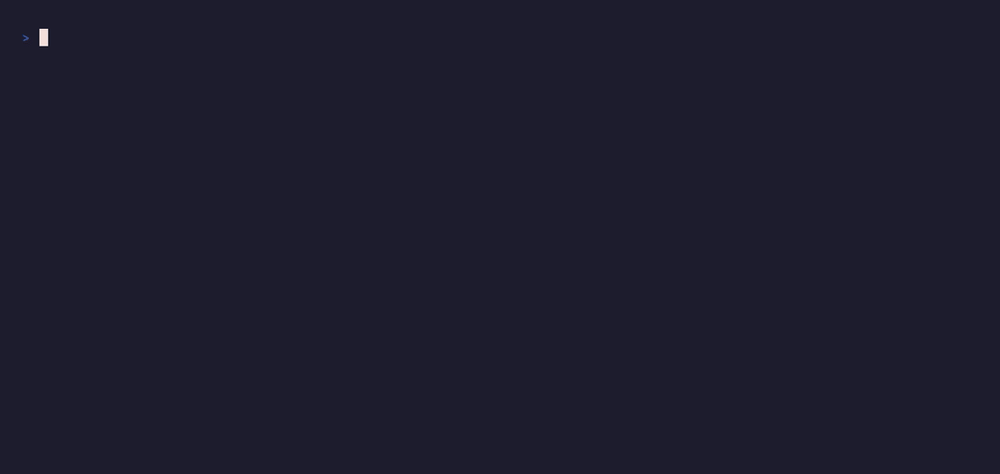

# auto-readme

Varre o repositório de forma estritamente read-only e gera um README de qualidade num arquivo separado. Não instala dependências, não altera código e não sobe serviços.

O resultado sai em `README_GENERATED.md`, nunca no seu `README.md`, para você revisar antes de adotar.

## Instalação

```bash
ln -s /home/Dom1ng0s/dev/Skills/auto-readme ~/.claude/skills/auto-readme
```

Chame com `/auto-readme` no Claude Code.

## Uso

No diretório atual:

```
/auto-readme
```

Num projeto específico:

```
/auto-readme ./caminho/do/projeto
```

## Privacidade

A skill nunca lê arquivos `.env` reais. Quando precisa listar as variáveis de ambiente que o projeto usa, ela deduz de fontes seguras: `.env.example`, `docker-compose.yml` ou chamadas a `os.getenv()` e `process.env` no código.

## O que ela descobre

Antes de escrever, a skill mapeia três coisas: qual é a stack principal (Flask, Node, React e afins), como o projeto roda (tem Dockerfile? Makefile? `requirements.txt`?) e qual o propósito da aplicação, olhando as rotas principais ou o nome do projeto.

## Estrutura do README gerado

O `README_GENERATED.md` tem seis seções:

- **Título e Badges:** nome do projeto e badges sugeridas (Python, Docker, licença).
- **Sobre o Projeto:** um parágrafo sobre o que o software faz.
- **Pré-requisitos:** o que precisa estar instalado na máquina.
- **Configuração de Ambiente:** tabela com as variáveis necessárias e para que servem.
- **Como Executar:** o passo a passo de comandos para rodar localmente.
- **Estrutura do Projeto:** uma árvore simplificada das pastas principais.

Depois de revisar, renomeie para `README.md` se quiser adotá-lo.

## Demo



> `/auto-readme` fazendo uma análise read-only de um app Flask real e gerando o `README_GENERATED.md`.
